# vulcat

* Vulcat can be used to scan for vulnerabilities on the Web side. When a vulnerability is discovered, the target URL and Payload are prompted. Users can manually verify the vulnerability according to the prompt<br/>
* Users can also write their own POC and add it to vulcat for scanning, You are also welcome to contribute your POC to the project
* If you have any ideas, suggestions, or bugs, you can issue

**Web applications that currently support scanning:**
> AlibabaDruid, AlibabaNacos, ApacheTomcat, Cicso, Spring, ThinkPHP, Weblogic, Yonyou

<details>
<summary><b>The current web vulnerabilities that support scanning: [Click on]</b></summary>

```
+---------------+------------------+------------+----------+------------------------------------------------------------+
| Target        | Vul_id           | Type       | Method   | Description                                                |
+---------------+------------------+------------+----------+------------------------------------------------------------+
| AlibabaDruid  | None             | unAuth     | GET      | 阿里巴巴Druid未授权访问                                      |
+---------------+------------------+------------+----------+------------------------------------------------------------+
| AlibabaNacos  | CVE-2021-29441   | unAuth     | GET/POST | 阿里巴巴Nacos未授权访问                                      |
+---------------+------------------+------------+----------+------------------------------------------------------------+
| ApacheTomcat  | CVE-2017-12615   | FileUpload | PUT      | PUT方法任意文件写入                                          |
+---------------+------------------+------------+----------+------------------------------------------------------------+
| Cisco         | CVE-2020-3580    | XSS        | POST     | 思科ASA/FTD XSS跨站脚本攻击                                  |
+---------------+------------------+------------+----------+------------------------------------------------------------+
| Django        | CVE-2017-12794   | XSS        | GET      | Django debug page XSS跨站脚本攻击                           |
| Django        | CVE-2019-14234   | SQLinject  | GET      | Django JSONfield SQL注入                                   |
+---------------+------------------+------------+----------+------------------------------------------------------------+
| Spring        | CVE-2022-22965   | RCE        | POST     | Spring Framework远程代码执行                                |
| Spring        | CVE-2021-21234   | FileRead   | GET      | Spring Boot目录遍历                                         |
| Spring        | CVE-2020-5410    | FileRead   | GET      | Spring Cloud目录遍历                                        |
+---------------+------------------+------------+----------+------------------------------------------------------------+
| ThinkPHP      | CNVD-2018-24942  | RCE        | GET      | 未开启强制路由导致RCE                                        |
| ThinkPHP      | CNNVD-201901-445 | RCE        | POST     | 核心类Request远程代码执行                                    |
+---------------+------------------+------------+----------+------------------------------------------------------------+
| Weblogic      | CVE-2020-14750   | unAuth     | GET      | Weblogic权限验证绕过                                        |
| Weblogic      | CVE-2019-2725    | deSerializa| POST     | Weblogic wls9_async反序列化                                 |
| Weblogic      | CVE-2017-10271   | deSerializa| POST     | Weblogic XMLDecoder反序列化                                 |
+---------------+------------------+------------+----------+------------------------------------------------------------+
| Yonyou        | CNVD-2021-30167  | RCE        | GET      | 用友NC BeanShell远程命令执行                                |
| Yonyou        | None             | FileRead   | GET      | 用友ERP-NC NCFindWeb目录遍历                                |
+---------------+------------------+------------+----------+------------------------------------------------------------+
```
</details>

## Installation & Usage
The tool is developed based on python3. Python3.8 or later is recommended

* Git: `git clone https://github.com/CLincat/vulcat.git`
* Zip: [click me](https://github.com/CLincat/vulcat/archive/refs/heads/main.zip)

```
git clone https://github.com/CLincat/vulcat.git
cd vulcat
python3 vulcat.py -h
```
```
Usage: python3 vulcat.py <options>
Examples:
python3 vulcat.py -u https://www.example.com/
python3 vulcat.py -u https://www.example.com/ -a thinkphp --log 3
python3 vulcat.py -f url.txt -t 10
python3 vulcat.py --list
```

## Options
```
Options:
  --version             show program's version number and exit
  -h, --help            show this help message and exit

  Target:
    Specify scan target

    -u URL, --url=URL   A url (e.g. -u http://www.example.com/)
    -f FILE, --file=FILE
                        A file containing multiple urls, one URL per line
                        (e.g. -f url.txt)
    -r, --recursive     Recursively scan each directory of the URL

  Optional:
    Optional function options

    -t THREAD, --thread=THREAD
                        The number of threads (default: 3)
    --delay=DELAY       Delay time/s (default: 0.5)
    --timeout=TIMEOUT   Timeout/s (default: 10)
    --http-proxy=HTTP_PROXY
                        The HTTP/HTTPS proxy (e.g. --http-proxy
                        127.0.0.1:8080)
    --user-agent=UA     Customize the User-Agent
    --cookie=COOKIE     Add a cookie
    --log=LOG           The log level, Optional 1-3 (default: 1)

  Application:
    Specify the target type for the scan

    -a APPLICATION, --application=APPLICATION
                        Specifies the target type, separated by commas (e.g.
                        thinkphp / thinkphp,weblogic) (default: all)

  Save:
    Save scan results

    --output-text=TXT_FILENAME
                        Save the scan results in TXT format, no vulnerability
                        will not generate files(e.g. --output-text result.txt)
    --output-json=JSON_FILENAME
                        Save the scan results in JSON format, no vulnerability
                        will not generate files(e.g. --output-text
                        result.json)

  Lists:
    Vulnerability list

    --list              View all payload

  Supported target types(Case insensitive):
    AliDruid,cisco,django,thinkphp,tomcat,nacos,spring,weblogic,yonyou
```

## language
You can change the language of -h/--help, currently only Chinese and English

* Open the vulcat/lib/initial/language.py
* Switching the "return" order and then saving the file implements the -h/--help language switch


## Custom POC
* How do I write my own vulnerability POC and add it to vulcat
* Find vulcat/payloads/demo.py, which is a POC template in Vulcat (semi-finished) and requires the user to fill in the rest of the code

* **Modify the steps:**
1. Make a copy of demo.py and save it to prevent template loss. Then change the name of the POC file (for example, thinkphp.py)
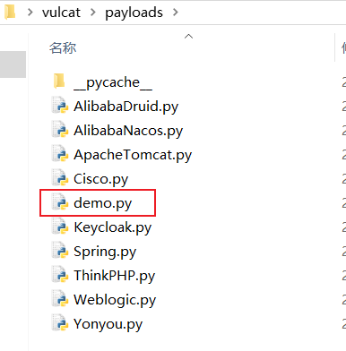
2. Modify the comment at the beginning of the file↓
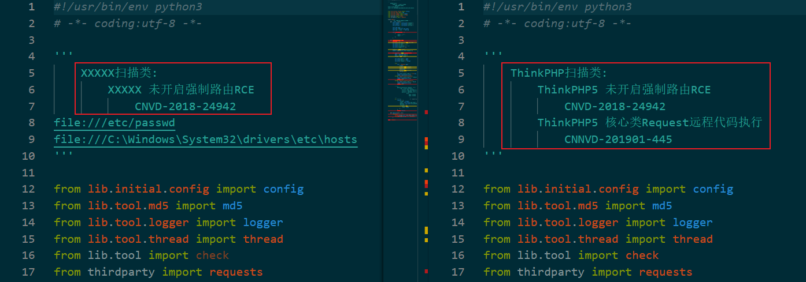
3. Modify according to the prompt next to the code↓
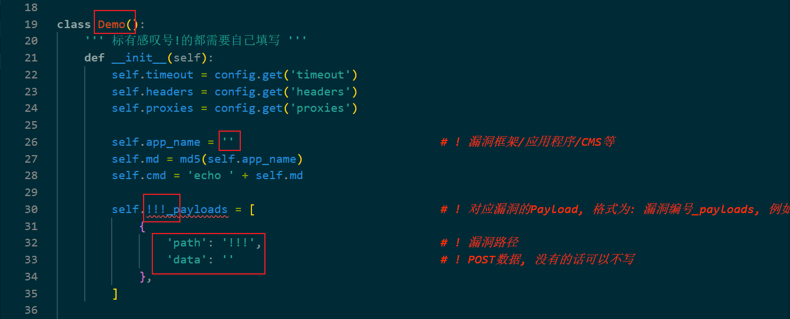
If payloads have multiple, add multiple paths and data
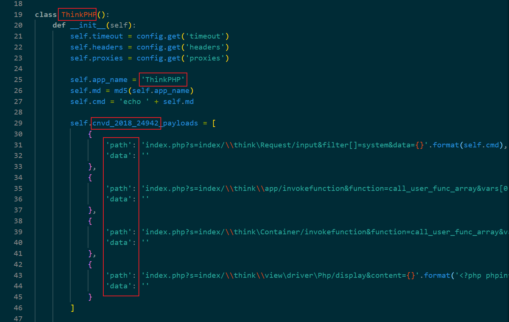
4. Modify the content as prompted↓

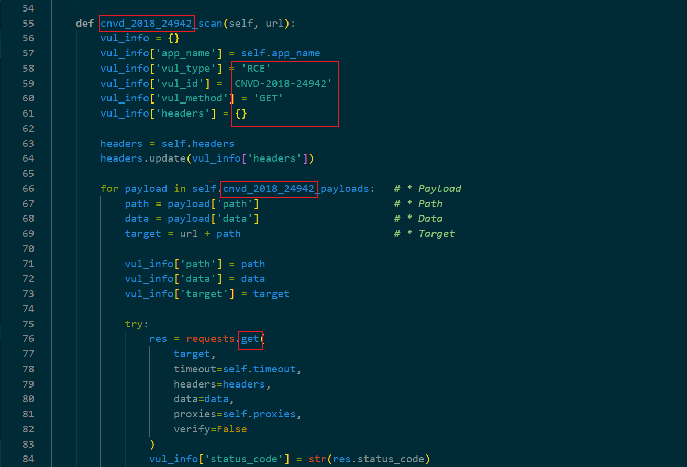
4. Modify the content as prompted↓
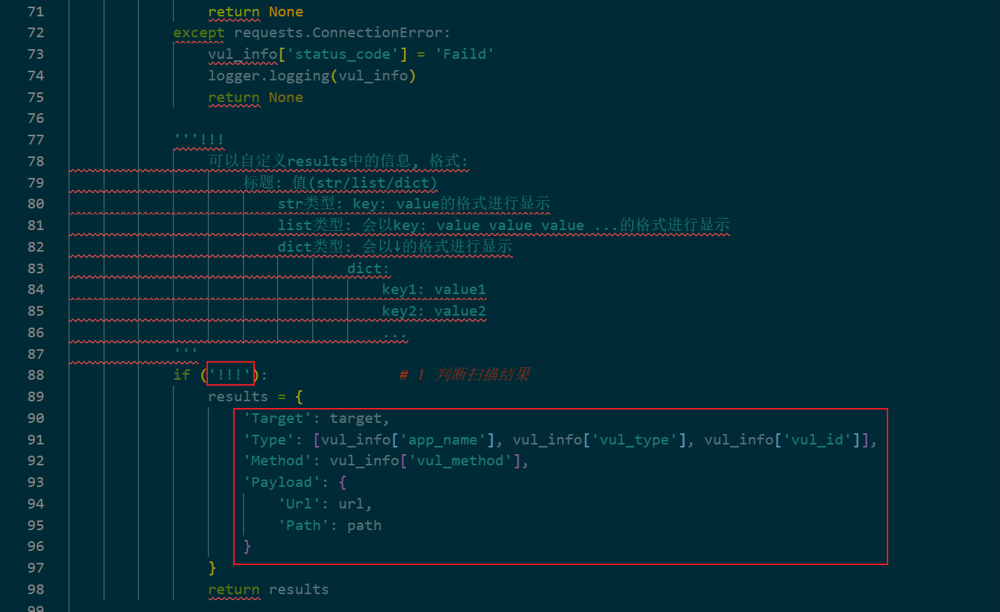
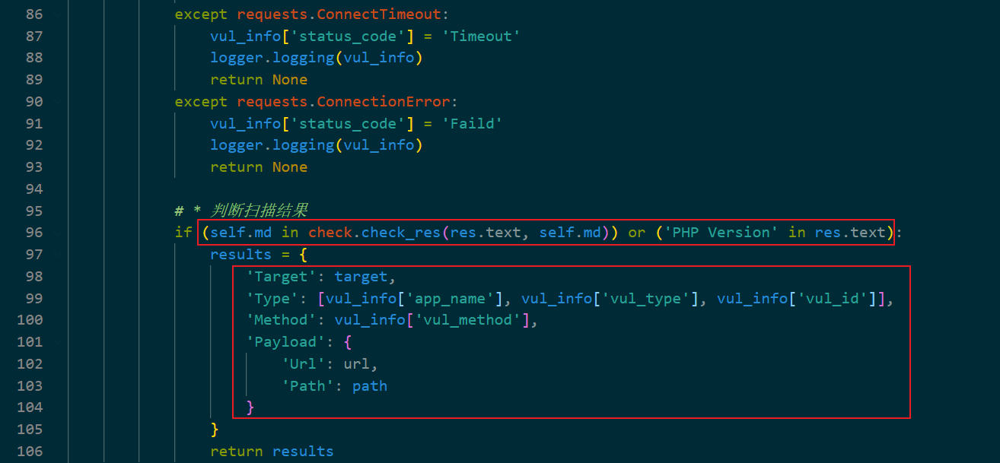
4. Modify the content as prompted↓
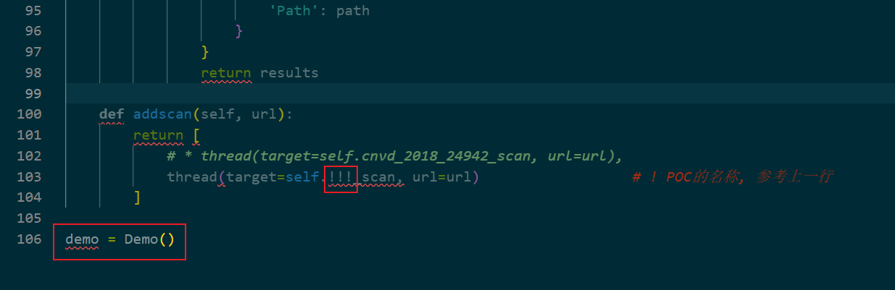
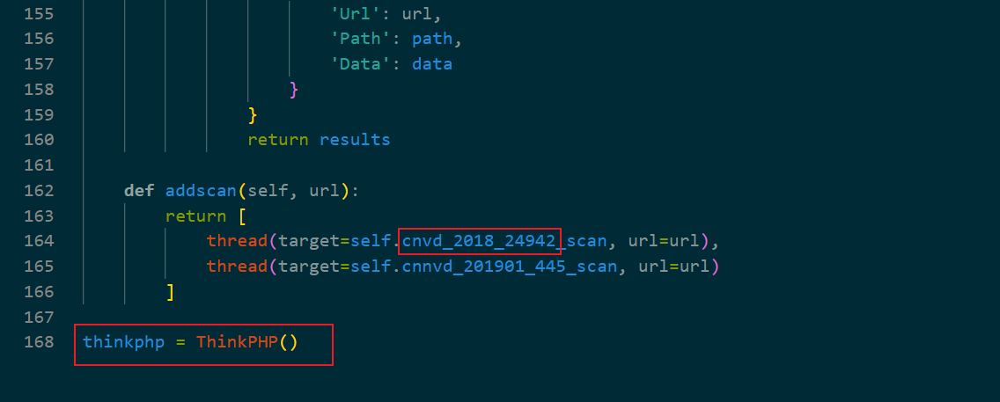
7. Open the vulcat/lib/initial/config.py, and add the application name (note: shall be the same name, see image below↓)
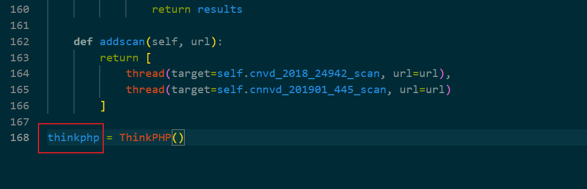
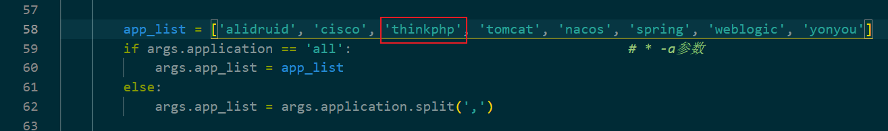
8. Open vulcat/lib/core/coreScan.py, import your POC, so far, vulcat can use your POC, you can now run the vulcat.py try out the effect of POC
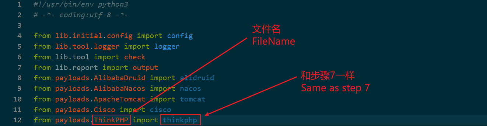
9. 如果你想在-h/--help中显示你的POC的应用程序名称, 打开vulcat/lib/initial/language.py, 找到以下代码并继续添加即可↓
9. If you want to in -h/--help show your POC application name, open the vulcat/lib/initial/language.py, find the following code and continue to add
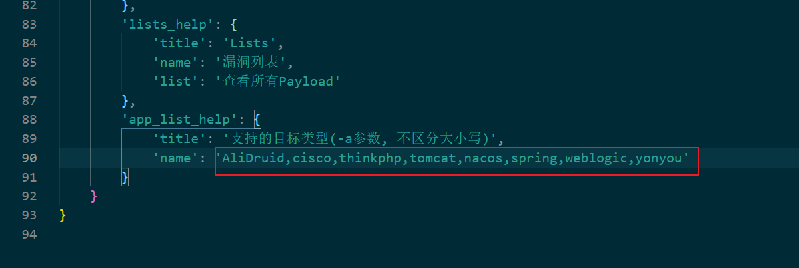
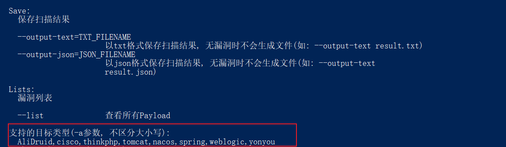

## Thanks
* [vulmap](https://github.com/zhzyker/vulmap)
* [sqlmap](https://github.com/sqlmapproject/sqlmap)
* [dirsearch](https://github.com/maurosoria/dirsearch)